<picture>
  <source media="(prefers-color-scheme: dark)" srcset="assets/dark_mode.svg">
  <source media="(prefers-color-scheme: light)" srcset="assets/light_mode.svg">
  
</picture>

### Selected work

- **[ba-forage-data-science](https://github.com/n-markov/ba-forage-data-science)** — RandomForest booking-completion classifier over 50k customer records, plus a pandas/openpyxl pipeline that rebuilds a lounge-eligibility table straight from raw schedules.
- **[Lab_sheets](https://github.com/n-markov/Lab_sheets)** — probability and statistics work in R.

<!-- Push these two and uncomment — they're the strongest things on your CV:
- **[colour-cnn-numpy](https://github.com/n-markov/colour-cnn-numpy)** — a CNN built from scratch in NumPy: im2col convolution, backprop by hand through conv/pool/dense, gradients checked against PyTorch autograd. ~89% on a 5,000-image held-out set.
- **[sp500-alpha-synthesis](https://github.com/n-markov/sp500-alpha-synthesis)** — three systematic S&P 500 strategies (quality momentum, composite value, equal weight) with an ETL pipeline and automated XlsxWriter reporting.
-->
